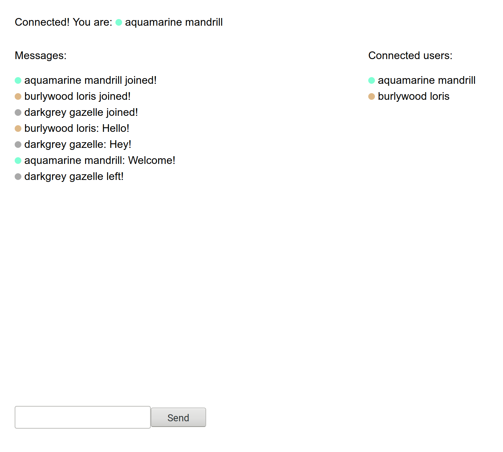

# Chat Socket with React

A more complete example of a simply chat server with React as a front-end

* [Noderize](https://noderize.js.org)
* [React](https://reactjs.org/) (with [`create-react-app`](https://github.com/facebook/create-react-app)
* [Socket.IO](https://socket.io)

[Demo](https://noderize-chat-socket-react.surge.sh/).

